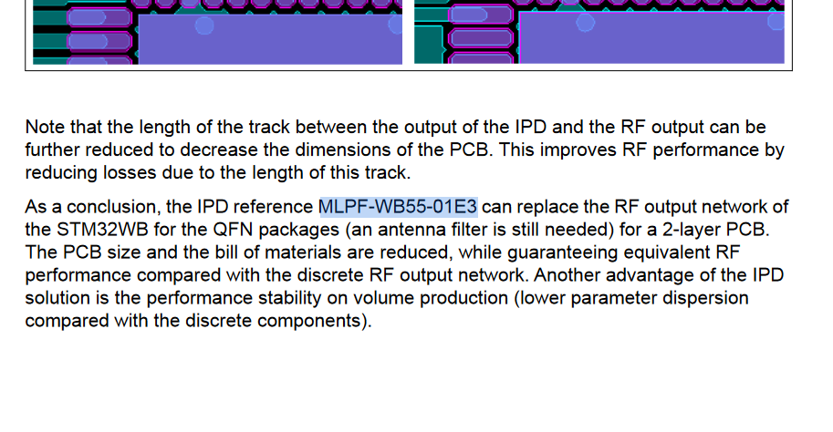
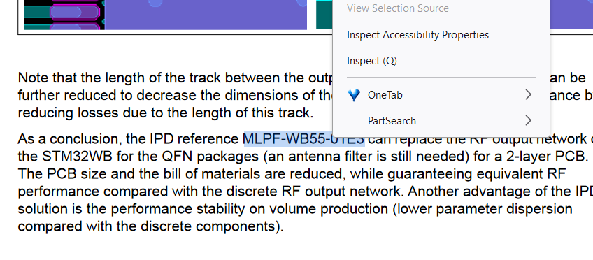
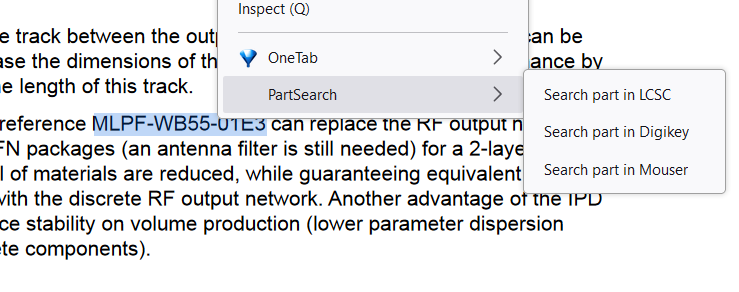

  </a>

  

---

# PartSearch

A search tool to quickly find parts in your favorite Electronics component distributor.

## What it does

PartSearch adds a context menu (right click menu) item that allows you to search for any part number by simply selecting the part number and right clicking and choosing your distributor. When you install the extension, you are promted to enter your preferred domain TLDs according to your country.

## Example

1) Select the part number in your browser

2) Right click on the selected text

3) Choose your distributor (More coming upon request)

